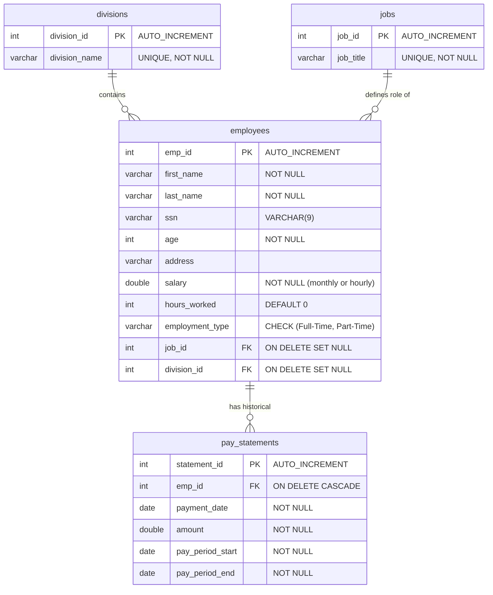
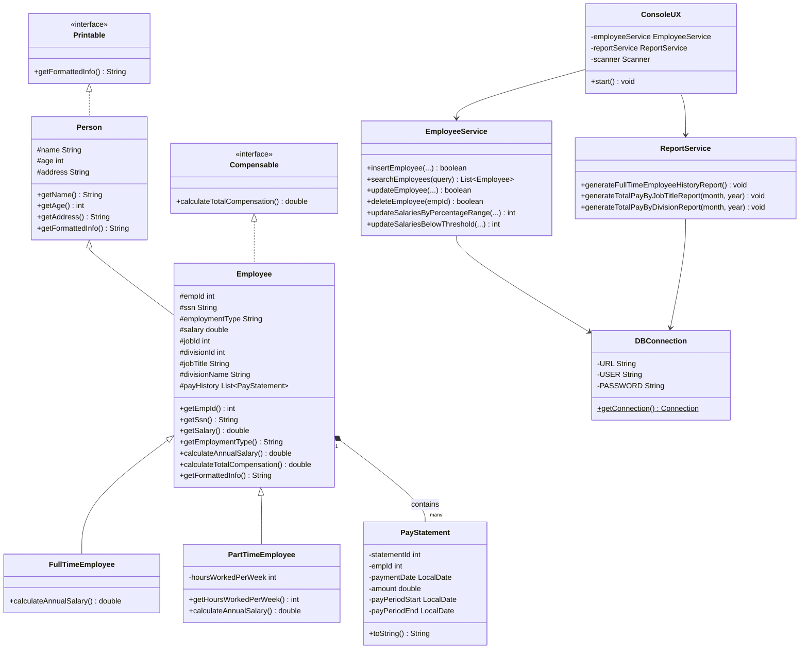
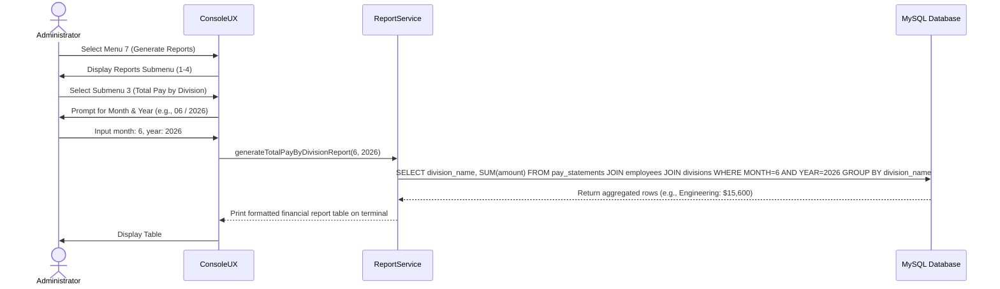

# Software Design Document (SWDD): Company Z Employee Management System

**Course**: Software Development - CTW  
**Team**: DreamWorks
**Deliverable**: Final Software Design Document (Section B)  
**Date**: July 19, 2026  

---

## Table of Contents
1. [Project Overview & Scenario](#1-project-overview--scenario)
2. [Database Schema Design](#2-database-schema-design)
   - [Original vs. Altered Schema](#original-vs-altered-schema)
   - [Database Entity-Relationship (ER) Diagram](#database-entity-relationship-er-diagram)
   - [Database Table Definitions](#database-table-definitions)
3. [Software Architecture & Java Class Design](#3-software-architecture--java-class-design)
   - [UML Class Diagram](#uml-class-diagram)
   - [Class & Interface Descriptions](#class--interface-descriptions)
4. [Detailed Programming Tasks](#4-detailed-programming-tasks)
5. [Sequence Diagrams](#5-sequence-diagrams)
   - [Overall System Flow (CRUD & Search)](#overall-system-flow-crud--search)
   - [Reporting Generation Flow](#reporting-generation-flow)
6. [Test Plan & Automated Test Cases](#6-test-plan--automated-test-cases)
   - [Test Cases Descriptions](#test-cases-descriptions)
   - [Pass/Fail Criteria Matrix](#passfail-criteria-matrix)
7. [Deployment & Execution Guide](#7-deployment-&-execution-guide)

---

## 1. Project Overview & Scenario

Company Z (also referred to as Company 2) is a small business with fewer than 20 full-time employees. Historically, the company had no graphical user interface (GUI) or interactive UX for managing its workforce. Database management was restricted to a single administrator running manual SQL scripts via Beaver/DBeaver.

To modernize their operations, this project delivers a **minimal working Employee Management System (EMS)**. The system provides a robust, interactive, menu-driven **Console UX** that interfaces with a MySQL database via **JDBC**. It supports:
- **Employee Profile Management**: Creating, reading, updating, and deleting (CRUD) employee information.
- **SSN Compliance**: Storing a 9-digit SSN (no dashes) as part of employee records.
- **Batch Salary Adjustments**: Applying percentage salary increases based on annual salary ranges or flat thresholds.
- **Reporting Services**: Generating formatted financial reports for divisions, job titles, and individual full-time payment histories.

There is no requirement for user logon/authorization functionality, making the application lightweight, quick to deploy, and focused on functional utility.

---

## 2. Database Schema Design

### Original vs. Altered Schema
1. **Original Schema**: The initial employee database schema stored employee details (Name, Age, Address, Salary, Type, Job ID, Division ID) but did not comply with federal record-keeping requirements as it was missing a Social Security Number (SSN) field.
2. **Altered Schema**: To satisfy **Requirement 1**, an `ALTER TABLE` statement was executed to add the `ssn` column as a 9-character string (without dashes) directly succeeding the employee name. This column was configured with validation to ensure exact length and format compliance.

### Database Entity-Relationship (ER) Diagram
The database consists of four related entities: `divisions`, `jobs`, `employees`, and `pay_statements`.



### Database Table Definitions

#### 1. Table: `divisions`
Holds departments/divisions within Company Z.
- `division_id` (INT, Primary Key, Auto Increment)
- `division_name` (VARCHAR(100), Unique, Not Null)

#### 2. Table: `jobs`
Holds standard job titles.
- `job_id` (INT, Primary Key, Auto Increment)
- `job_title` (VARCHAR(100), Unique, Not Null)

#### 3. Table: `employees`
Stores employee profiles.
- `emp_id` (INT, Primary Key, Auto Increment)
- `first_name` (VARCHAR(50), Not Null)
- `last_name` (VARCHAR(50), Not Null)
- `ssn` (VARCHAR(9), Nullable) - *Added via ALTER TABLE*
- `age` (INT, Not Null)
- `address` (VARCHAR(255), Nullable)
- `salary` (DOUBLE, Not Null) - Monthly base salary for Full-Time, hourly rate for Part-Time.
- `hours_worked` (INT, Default 0) - Weekly hours worked (used for Part-Time annual salary calculation).
- `employment_type` (VARCHAR(20), Not Null) - Validated via check constraint: `('Full-Time', 'Part-Time')`.
- `job_id` (INT, Foreign Key referencing `jobs(job_id)`)
- `division_id` (INT, Foreign Key referencing `divisions(division_id)`)

#### 4. Table: `pay_statements`
Stores pay statement records to build a historical pay ledger.
- `statement_id` (INT, Primary Key, Auto Increment)
- `emp_id` (INT, Foreign Key referencing `employees(emp_id)`, On Delete Cascade)
- `payment_date` (DATE, Not Null)
- `amount` (DOUBLE, Not Null)
- `pay_period_start` (DATE, Not Null)
- `pay_period_end` (DATE, Not Null)

---

## 3. Software Architecture & Java Class Design

The software architecture is built on the **SOLID design principles**:
- **Single Responsibility (SRP)**: Data formatting, business services, and database connections are separated.
- **Open/Closed (OCP)**: Class inheritance (`Employee` extended by `FullTimeEmployee` and `PartTimeEmployee`) allows different compensation behaviors without modifying the parent class.
- **Interface Segregation (ISP)**: Separate, specific interfaces are defined for `Printable` and `Compensable`.
- **Dependency Inversion (DIP)**: High-level services depend on abstract model classes and connection boundaries.

### UML Class Diagram



### Class & Interface Descriptions

1. **`Printable` (Interface)**: Segregates printing behaviors. Classes implementing this must return a structured string of their properties.
2. **`Compensable` (Interface)**: Segregates financial behaviors, requiring implementations of annual earnings calculations.
3. **`Person` (Base Class)**: Captures general attributes (`name`, `age`, `address`) for any human actor in the system.
4. **`Employee` (Model Class)**: Inherits from `Person` and binds employment metrics. Resolves SQL relationships (division names, job titles) into class fields.
5. **`FullTimeEmployee` & `PartTimeEmployee` (Subclasses)**: Implement custom overrides of `calculateAnnualSalary()`. A Full-Time employee calculates annual pay as `monthly base * 12`. A Part-Time employee calculates annual pay as `hourly wage * weekly hours * 52`.
6. **`PayStatement` (Model Class)**: Implements pay structure mapping to represent an employee's historical earnings statements.
7. **`DBConnection` (Utility)**: Provides a single static gateway to retrieve the MySQL JDBC `Connection` object, handling driver initialization.
8. **`EmployeeService` (Service)**: Handles SQL statement preparation and execution for database modifications (inserts, edits, deletes, search, and batch updates).
9. **`ReportService` (Service)**: Bundles aggregated SQL queries (`GROUP BY` and `SUM` joins) to spit out clean, text-based financial tables.
10. **`ConsoleUX` (Presentation)**: Binds the services to keyboard scanner prompts to run an interactive terminal menu.

---

## 4. Detailed Programming Tasks

To build this system, 5 primary programming tasks were carved out from the user requirements:

| Task ID | Name | Description | Database SQL / Java Mapping |
|---|---|---|---|
| **Task 1** | **Database Schema Alteration** | Add the `ssn` column to the existing table to support Social Security Numbers. | `ALTER TABLE employees ADD COLUMN ssn VARCHAR(9) AFTER last_name;` |
| **Task 2** | **Record Insertion** | Add employee profiles and financial pay statement records to the database. | JDBC PreparedStatement inserting into `employees` and `pay_statements` tables. |
| **Task 3** | **Employee Lookup** | Search for employees matching an arbitrary string (ID, Name, or SSN). | `SELECT` statement joining `jobs` and `divisions` with a multi-criteria `WHERE` clause. |
| **Task 4** | **Employee Modification** | Update profile elements, department, job title, and salary figures. | PreparedStatement executing `UPDATE employees SET ... WHERE emp_id = ?`. |
| **Task 5** | **Batch Salary Adjustment** | Increase employee salaries by a percentage only if they fall inside a specific annual salary range. | `UPDATE employees SET salary = salary * (1 + %/100) WHERE (annual_salary) BETWEEN min AND max`. |

---

## 5. Sequence Diagrams

### Overall System Flow (CRUD & Search)
This diagram illustrates the flow of a user performing search, insert, and update operations via the Console UX through to the database.

```mermaid
sequenceDiagram
    actor User as Administrator
    participant UX as ConsoleUX
    participant Service as EmployeeService
    participant DB as MySQL Database

    %% Search Flow
    User->>UX: Select Menu 1 (Search)
    UX->>User: Prompt for query (ID, Name, or SSN)
    User->>UX: Input query (e.g. "Jane")
    UX->>Service: searchEmployees("Jane")
    Service->>DB: SELECT * FROM employees JOIN jobs JOIN divisions WHERE name LIKE '%Jane%'
    DB-->>Service: Return matching rows (e.g. Jane Smith)
    Service->>DB: SELECT * FROM pay_statements WHERE emp_id = 3
    DB-->>Service: Return pay statements list
    Service-->>UX: Return List<Employee>
    UX->>User: Display formatted employee details & pay statements

    %% Insert Flow
    User->>UX: Select Menu 2 (Add Employee)
    UX->>DB: SELECT * FROM divisions; SELECT * FROM jobs
    DB-->>UX: Return available divisions and jobs
    UX->>User: Prompt for Name, SSN, Age, Address, Salary, JobID, DivisionID
    User->>UX: Enter data
    UX->>Service: insertEmployee(firstName, lastName, ssn, age, address, salary, ...)
    Service->>DB: INSERT INTO employees (...)
    DB-->>Service: Affected Rows: 1
    Service-->>UX: Return success status (true)
    UX->>User: Display "Employee added successfully!"
```

### Reporting Generation Flow
This diagram illustrates the retrieval of aggregated metrics and histories.



---

## 6. Test Plan & Automated Test Cases

To verify that core business and database operations perform correctly and preserve data integrity, we built three automated test scenarios into `tests/SystemTests.java`.

### Test Cases Descriptions

1. **Test Case A: Update Employee Data**
   - **Procedure**: Fetch employee ID 1 ("John Doe"). Execute an update modifying their Age to 31, Address to "404 New Lane", and monthly salary to $5,200.00. Query the database again to assert that these updates were written. Revert all changed values to their original state to prevent database pollution.
2. **Test Case B: Search Employee**
   - **Procedure**: Query the system using three different keys: Name ("Jane"), SSN ("987654321"), and Employee ID ("5"). Verify that each search successfully finds the correct employee matching those unique identifiers.
3. **Test Case C: Salary Below Threshold Batch Update**
   - **Procedure**: Query the database to find an employee earning less than a $60,000/yr threshold (Bob Miller, ID 4, making $57,600/yr) and one earning more (Charlie Brown, ID 5, making $108,000/yr). Execute `updateSalariesBelowThreshold(percentage=10.0, threshold=60000.0)`. Verify that Bob's salary increased by exactly 10% and Charlie's salary remained unchanged. Divide Bob's salary back by 1.10 to restore database state.

### Pass/Fail Criteria Matrix

| Test Case | Method Executed | Input values | Expected Result | Pass Condition |
|---|---|---|---|---|
| **Test Case A** | `updateEmployee` | ID: 1, Age: 31, Addr: '404 New Lane', Salary: 5200.00 | DB fields are modified; reading back ID 1 returns the new values. | DB values match updated values; reverts successfully. |
| **Test Case B** | `searchEmployees` | Query "Jane", "987654321", "5" | Search returns Jane Smith, Alice Johnson, and Charlie Brown respectively. | All three searches return correct records; list size > 0. |
| **Test Case C** | `updateSalariesBelowThreshold` | Percentage: 10.0%, Threshold: $60,000.00 | Bob Miller's salary increases by 10% ($57,600 -> $63,360). Charlie Brown's salary remains unchanged. | Bob's salary is modified by 1.1x. Charlie's salary remains identical. Reverts successfully. |

---

## 7. Deployment & Execution Guide

### Prerequisites
1. **Java Development Kit (JDK)**: Ensure JDK 8 or higher is installed (`javac` and `java` available in terminal).
2. **MySQL Server**: Ensure MySQL is running on `localhost:3306`.
3. **Credentials**: A database user `root` with password `` is required, or update `DBConnection.java` with your specific credentials.

### Step 1: Database Initialization
Open your terminal and run the setup script to initialize the database:
```bash
mysql -u root -p < finalproject/db_setup.sql
```

### Step 2: Compile the Java Application
Navigate to the root workspace directory and run `javac` to build the classes:
```bash
javac -d finalproject/bin -cp finalproject/lib/mysql-connector-j.jar finalproject/src/models/*.java finalproject/src/db/*.java finalproject/src/services/*.java finalproject/src/ui/*.java finalproject/src/tests/*.java finalproject/src/Driver.java
```

### Step 3: Run the Automated Test Suite
Verify database transactions and service calculations by running the system test suite:
```bash
java -cp finalproject/bin:finalproject/lib/mysql-connector-j.jar tests.SystemTests
```

### Step 4: Run the Interactive Application
Boot up the Console UX to interact with the database in real-time:
```bash
java -cp finalproject/bin:finalproject/lib/mysql-connector-j.jar Driver
```
